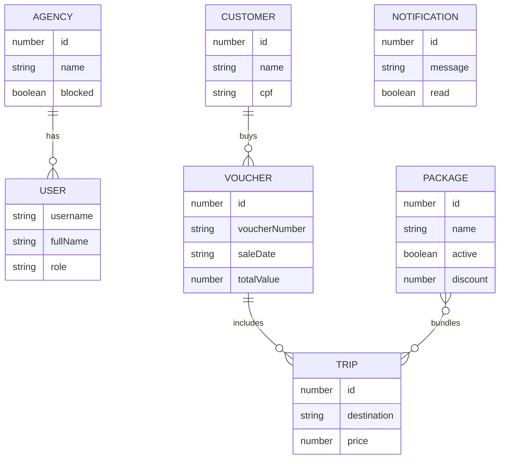
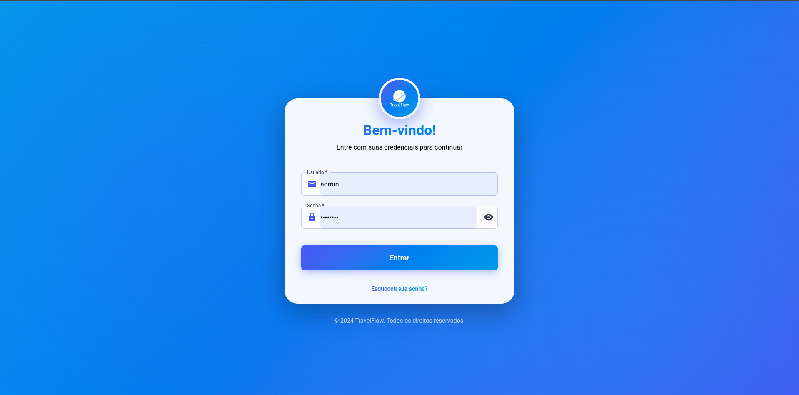
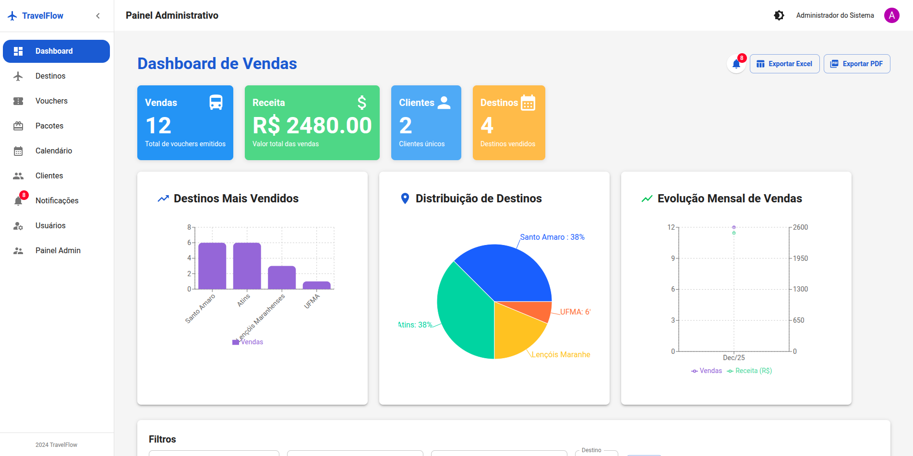
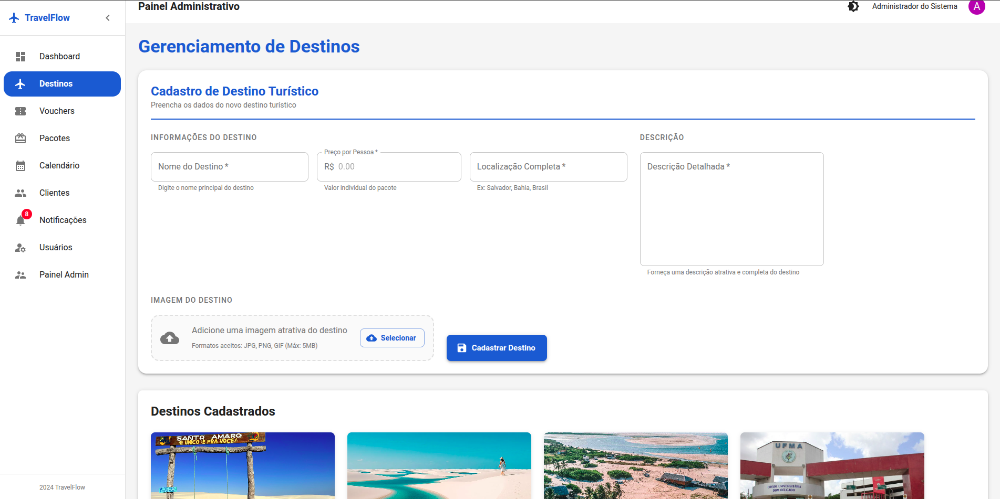
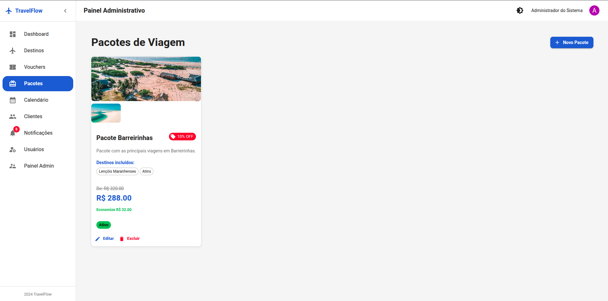
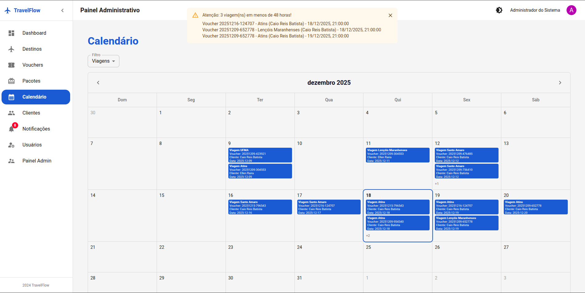
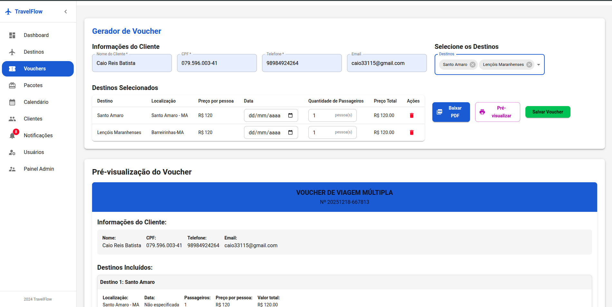
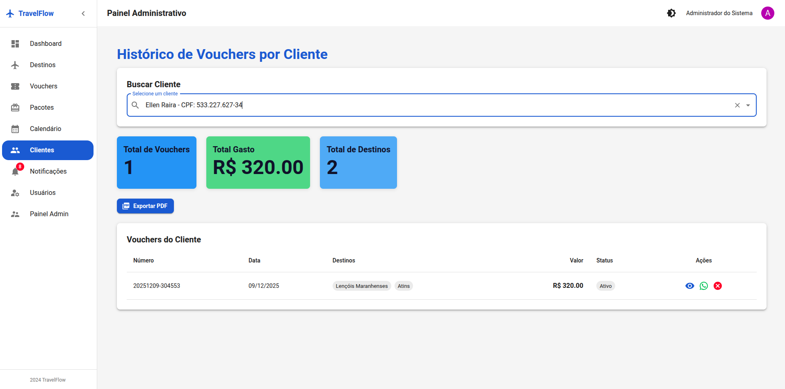
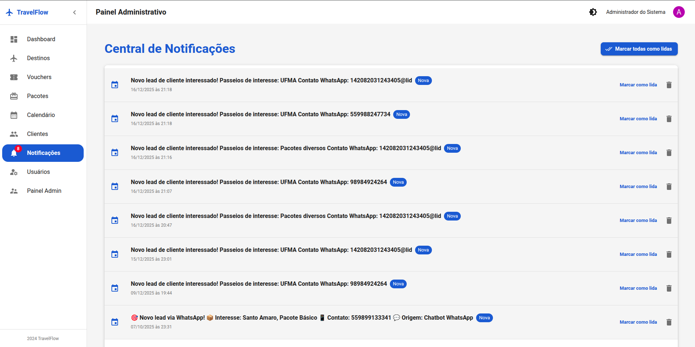

# TravelFlow (Frontend) - Plataforma de Gestão de Viagens


Sistema web para **gestão de destinos, pacotes e vouchers**, com **dashboard de vendas**, exportação de relatórios e módulos administrativos (usuários/agências), consumindo uma API REST.

## Sumário

- [Autor](#autor)
- [Descrição detalhada](#descrição-detalhada)
- [Tecnologias utilizadas (versões)](#tecnologias-utilizadas-versões)
- [Pré-requisitos](#pré-requisitos)
- [Instalação (passo a passo)](#instalação-passo-a-passo)
- [Configuração](#configuração)
- [Execução](#execução)
- [Estrutura do projeto (detalhada)](#estrutura-do-projeto-detalhada)
- [Funcionalidades implementadas](#funcionalidades-implementadas)
- [Modelo de dados (visão de domínio - frontend)](#modelo-de-dados-visão-de-domínio---frontend)
- [Rotas da aplicação (Frontend)](#rotas-da-aplicação-frontend)
- [Documentação da API (consumo pelo frontend)](#documentação-da-api-consumo-pelo-frontend)
- [Diagrama de Arquitetura](#diagrama-de-arquitetura)
- [Screenshots (mínimo 8)](#screenshots-mínimo-8)
- [Vídeo demonstrativo](#vídeo-demonstrativo)
- [Decisões técnicas](#decisões-técnicas)
- [Melhorias futuras](#melhorias-futuras)

## Autor

- **Nome:** Caio Reis Batista
- **Matrícula:** 20240000791

## Descrição detalhada

O **TravelFlow (Frontend)** é a interface web do sistema de gestão de viagens. Ele oferece:

- Operações administrativas de **destinos/viagens**, **pacotes** e **vouchers**.
- Um **dashboard** com indicadores, gráficos e exportação.
- Módulos de suporte para **clientes**, **notificações**, **usuários** e **agências**.

O projeto foi construído com foco em:

- **Experiência do usuário** (UI consistente com Material UI, feedbacks e validações).
- **Separação de responsabilidades** (páginas/rotas vs. camada `services`).
- **Confiabilidade na integração** (tratamento padronizado de erros e sessão).

## Tecnologias utilizadas (versões)

As versões abaixo foram obtidas do `package.json` do projeto.

- **Node.js:** 18+ (recomendado)
- **Vite:** 7.2.4
- **React:** 19.2.0
- **React DOM:** 19.2.0
- **React Router DOM:** 7.9.6
- **Material UI:**
  - `@mui/material`: 7.3.5
  - `@mui/icons-material`: 7.3.5
  - `@mui/x-date-pickers`: 7.0.0
- **Emotion (CSS-in-JS):**
  - `@emotion/react`: 11.14.0
  - `@emotion/styled`: 11.14.1
- **Gráficos:** `recharts` 2.13.3
- **Datas:** `dayjs` 1.11.19, `date-fns` 2.30.0
- **PDF/Exportações:**
  - `jspdf` 3.0.4
  - `jspdf-autotable` 5.0.2
  - `@react-pdf/renderer` 4.3.1
  - `xlsx` 0.18.5
- **E-mail:** `@emailjs/browser` 4.4.1
- **Lint:** `eslint` 9.39.1

## Pré-requisitos

- **Node.js 18+** (recomendado)
- **npm** (os scripts do projeto estão em npm)
- Uma **API backend** rodando para as funcionalidades que consomem endpoints (por padrão em `http://localhost:8080`).
- (Opcional) **Conta no EmailJS** configurada caso você queira testar envio de e-mail.
- (Opcional) Serviço externo de WhatsApp em `http://localhost:3001` para o botão de envio de mensagem.

## Instalação (passo a passo)

1. Clone/baixe o projeto.
2. Instale as dependências:

```bash
npm install
```

3. Configure o ambiente (recomendado):

```bash
cp .env.example .env
```

4. Edite o arquivo `.env` com seus valores (detalhes na seção [Configuração](#configuração)).

## Configuração

As variáveis do frontend são lidas via `import.meta.env` (padrão do Vite).

Arquivo de referência: `.env.example`.

### Variáveis de ambiente

- `VITE_API_URL`
  - **Obrigatória para integração** com a API.
  - Exemplo: `http://localhost:8080`

- `VITE_EMAILJS_SERVICE_ID`, `VITE_EMAILJS_TEMPLATE_ID`, `VITE_EMAILJS_PUBLIC_KEY`
  - **Opcionais**.
  - Necessárias apenas para testar o envio de e-mail do voucher.

## Execução

### Rodar em modo desenvolvimento

```bash
npm run dev
```

A aplicação ficará disponível (por padrão do Vite) em:

- `http://localhost:5173`

### Build/preview

```bash
npm run build
npm run preview
```

## Estrutura do projeto (detalhada)

```text
public/               Arquivos públicos (servidos diretamente)
src/
  assets/            Arquivos estáticos
  components/        Componentes reutilizáveis (layout/common)
  contexts/          Contextos globais (AuthContext, ThemeContext)
  pages/             Páginas por módulo (Dashboard, Trips, Vouchers, etc.)
  routes/            Definição de rotas do React Router
  services/          Integração com a API + utilitários (export/email)
  theme.js           Tema do Material UI
  main.jsx           Bootstrap do React
  App.jsx            Providers (tema + autenticação) + rotas
```

### Camada de serviços (`src/services`)

- `api.js`: `fetchApi()` com header `Authorization`, tratamento de erros e `ApiError`.
- `dashboardService.js`, `tripService.js`, `packageService.js`, `voucherService.js`, `customerService.js`, `notificationService.js`, `userService.js`, `agencyService.js`: chamadas para endpoints específicos.
- `exportService.js`: exportação PDF/Excel (relatórios e tabelas).
- `emailService.js`: integração EmailJS (variáveis `VITE_EMAILJS_*`).

## Funcionalidades implementadas

- **Autenticação**
  - Login via API (`/auth/login`)
  - Armazenamento de `token` e `user` no `localStorage`
  - **Rotas protegidas** com `ProtectedRoute`
  - Logout global automático quando API retorna `401/403` (callback via `setGlobalLogoutCallback`)

- **Recuperação de senha**
  - Solicitação de reset por e-mail (fluxo público)
  - Confirmação do reset com token e definição de nova senha

- **Dashboard (Vendas/Admin)**
  - Estatísticas gerais (vendas, receita, clientes, destinos)
  - Gráficos (bar/pie/line/area) com `recharts`
  - Filtros por texto/período/destino
  - Exportação de relatórios para **PDF e Excel**
  - Central de notificações (contagem de não lidas)

- **Destinos / Viagens (`/trips`)**
  - CRUD de destinos (criar, listar, editar, excluir)
  - Upload/preview de imagem (via `FileReader`/base64)
  - Validação de formulário (campos obrigatórios e preço)

- **Vouchers (`/vouchers`)**
  - Seleção de destinos
  - Geração de voucher com dados do cliente
  - Geração de **PDF** do voucher (`@react-pdf/renderer`)
  - Envio de voucher por **e-mail** via EmailJS (depende de variáveis `VITE_EMAILJS_*`)
  - Listagem de vouchers vendidos

- **Pacotes (`/packages`)**
  - CRUD de pacotes
  - Associação de pacotes a múltiplos destinos
  - Controle de desconto e status ativo/inativo
  - Upload/preview de múltiplas imagens
  - Página de calendário (`/package-calendar`) usando componente `PackageCalendar`

- **Clientes (`/customers`)**
  - Consulta do histórico de vouchers por cliente
  - Estatísticas por cliente (quantidade, gasto, destinos)
  - Exportação do histórico para PDF
  - Ação de envio de mensagem WhatsApp (depende de serviço externo em `http://localhost:3001`)

- **Notificações (`/notifications`)**
  - Visualização de notificações e ações de marcar como lida

- **Usuários (`/users`)**
  - CRUD de usuários (apenas para perfil ADMIN)

- **Painel Administrativo (`/admin-panel`)**
  - Listagem/gestão de agências (criar/editar/excluir/bloquear)
  - Visão consolidada de agências e usuários

- **Perfil (`/profile`)**
  - Consulta do perfil (`/auth/me`) e edição de dados básicos

## Modelo de dados (visão de domínio - frontend)

O frontend trabalha com um **modelo de domínio** (objetos JSON vindos da API) para renderizar telas, gerar relatórios e PDFs.



Obs.: este diagrama é uma **representação conceitual** para documentação do frontend (não é o schema do banco).

## Funcionalidades não implementadas (nesta entrega)

- **Banco de dados no frontend:** não se aplica (dados vêm do backend). No frontend, apenas `localStorage` para sessão.
- **Controle fino por perfil/role em todas as rotas:** existe checagem em páginas (ex.: `UserManagement`), porém não há um `RoleRoute` centralizado para todas as rotas.
- **Integração real de WhatsApp:** há chamada para um endpoint externo (`http://localhost:3001/api/whatsapp/send`), mas não existe um serviço formal no projeto (arquivo `whatsappService` está comentado).
- **Upload de imagens para storage (S3, Cloudinary etc.):** o upload atual é via base64 no cliente, sem persistência dedicada.

## Decisões técnicas

- **React + Vite:** escolhido por rapidez de setup, HMR e build otimizado.
- **Material UI (MUI):** acelera a construção de uma UI consistente, responsiva e com componentes prontos.
- **Context API:** usada para manter **autenticação** e **tema (dark/light)** sem depender de libs extras.
- **Sem banco de dados no frontend:** o frontend apenas consome a API; persistência é responsabilidade do backend. O frontend guarda apenas token/usuário.
- **Serviços (`src/services`)**: centralizam chamadas HTTP e isolam a UI dos endpoints.

## Melhorias futuras

- **Padronização de permissões por rota**: criar um `RoleRoute` (ou wrapper) para restringir páginas por `role` de forma centralizada.
- **Testes automatizados**: adicionar testes de componentes e páginas (ex.: Vitest + Testing Library).
- **Observabilidade**: adicionar captura de erros (ex.: boundary) e logs estruturados para depuração.
- **Cache/estado remoto**: avaliar React Query/SWR para cache, invalidações e sincronização.
- **Upload de imagens com storage dedicado**: integrar S3/Cloudinary para persistência real.

## Rotas da aplicação (Frontend)

Rotas definidas em `src/routes/index.jsx`:

| Rota | Tipo | Descrição |
|------|------|-----------|
| `/` | Pública | Redireciona para `/login` ou `/dashboard` |
| `/login` | Pública | Login |
| `/password-reset` | Pública | Solicitar recuperação de senha |
| `/password-reset/confirm` | Pública | Confirmar reset (nova senha) |
| `/dashboard` | Protegida | Dashboard de vendas/indicadores |
| `/trips` | Protegida | Gestão de destinos |
| `/vouchers` | Protegida | Geração/gestão de vouchers |
| `/packages` | Protegida | Gestão de pacotes |
| `/package-calendar` | Protegida | Calendário de pacotes |
| `/customers` | Protegida | Histórico de vouchers por cliente |
| `/notifications` | Protegida | Central de notificações |
| `/users` | Protegida | Gestão de usuários (admin) |
| `/admin-panel` | Protegida | Painel admin de agências (perfil elevado) |
| `/profile` | Protegida | Perfil do usuário |

## Documentação da API (consumo pelo frontend)

URL base configurável via `VITE_API_URL` (padrão: `http://localhost:8080`).

### Autenticação e sessão

- **Header**: quando houver `token` no `localStorage`, o frontend envia:

```text
Authorization: Bearer <token>
```

- **Expiração/negação**: quando a API responde `401` ou `403`, o frontend dispara logout global (via `setGlobalLogoutCallback`).

### Convenção de erros

- Para respostas não-OK (`!response.ok`), o frontend tenta ler JSON e usa `message`/`error` para exibir feedback.
- Caso não haja JSON, usa `statusText`.

### Endpoints consumidos (lista)

Os endpoints abaixo são os que aparecem na camada `src/services/*`.

### Autenticação

- `POST /auth/login`
- `GET /auth/me`
- `PUT /auth/me`
- `POST /auth/register`
- `POST /auth/password-reset/request`
- `POST /auth/password-reset/confirm`
- `GET /auth/users`
- `GET /auth/agencies` (existe no `authService`)
- `GET /auth/agencies/all` (usado em `agencyService`)
- `POST /auth/agencies`

### Vouchers

- `GET /vouchers`
- `GET /vouchers/{id}`
- `POST /vouchers`
- `PUT /vouchers/{id}`
- `DELETE /vouchers/{id}`

### Destinos/Trips

- `GET /trips`
- `GET /trips/{id}`
- `POST /trips`
- `PUT /trips/{id}`
- `DELETE /trips/{id}`

### Pacotes

- `GET /packages`
- `GET /packages/{id}`
- `POST /packages`
- `PUT /packages/{id}`
- `DELETE /packages/{id}`

### Clientes

- `GET /customers`
- `GET /customers/{id}`
- `GET /customers/cpf/{cpf}`
- `POST /customers`
- `PUT /customers/{id}`
- `DELETE /customers/{id}`

### Dashboard

- `GET /dashboard/stats`
- `GET /dashboard/top-destinations?limit={n}`
- `GET /dashboard/sales?startDate=YYYY-MM-DD&endDate=YYYY-MM-DD`
- `GET /dashboard/monthly-revenue`

### Notificações

- `GET /notifications`
- `GET /notifications/unread`
- `PATCH /notifications/{id}/read`
- `PATCH /notifications/read-all`
- `POST /notifications`
- `DELETE /notifications/{id}`

### Agências

- `GET /agencies/{id}`
- `PUT /agencies/{id}`
- `DELETE /agencies/{id}`
- `PATCH /agencies/{id}/block`
- `GET /agencies/{id}/stats`

### Integração externa (WhatsApp - opcional)

- `POST http://localhost:3001/api/whatsapp/send`

### Métodos, parâmetros e exemplos (referência de consumo)

Como o contrato exato (schema) é do backend, abaixo ficam **exemplos mínimos** do que o frontend envia/espera.

#### `POST /auth/login`

- **Body** (JSON):

```json
{ "username": "admin", "password": "admin" }
```

- **Resposta esperada (exemplo)**: retorna um `token` e dados do usuário.
- **Status comuns**:
  - `200` sucesso
  - `401` credenciais inválidas

#### `POST /auth/password-reset/request`

- **Body** (JSON):

```json
{ "email": "admin@travelflow.com.br" }
```

- **Resposta esperada**: retorna um `token` e `expiresAt` (TTL ~ 30 min).
- **Status comuns**:
  - `200` sucesso
  - `400` e-mail inválido
  - `404` usuário/e-mail não encontrado (depende do backend)

#### `POST /auth/password-reset/confirm`

- **Body** (JSON):

```json
{ "token": "TOKEN_RECEBIDO_NO_REQUEST", "newPassword": "novaSenha123" }
```

- **Status comuns**:
  - `200` sucesso
  - `400` token inválido/expirado ou senha inválida

#### `GET /dashboard/sales?startDate=YYYY-MM-DD&endDate=YYYY-MM-DD`

- **Query params**:
  - `startDate`: string `YYYY-MM-DD`
  - `endDate`: string `YYYY-MM-DD`

- **Status comuns**:
  - `200` sucesso
  - `400` parâmetros inválidos
  - `401/403` sem permissão

#### `PATCH /notifications/{id}/read`

- **Path param**:
  - `id`: id da notificação

- **Status comuns**:
  - `200` sucesso
  - `404` não encontrada

#### Endpoints CRUD (`trips`, `packages`, `vouchers`, `customers`)

- `GET /resource`: lista
- `GET /resource/{id}`: detalhe
- `POST /resource`: cria
- `PUT /resource/{id}`: atualiza
- `DELETE /resource/{id}`: remove

### Códigos de status HTTP tratados no frontend

- `200–299`: sucesso
- `400`: validação/entrada inválida (exibido via `ApiError.message`)
- `401/403`: logout automático + redirecionamento para login
- `404`: recurso não encontrado
- `500`: erro interno
- `0`: erro de rede/conexão (quando o `fetch` falha)

## Diagrama de Arquitetura

O diagrama abaixo documenta a arquitetura **do sistema sob a ótica do frontend** (UI, camada de serviços e integrações).

```mermaid
flowchart LR
  U[Usuário] -->|Navegação| R[React Router]
  R --> P[Páginas (src/pages)]
  P --> C[Componentes (src/components)]
  P --> S[Services (src/services)]
  S -->|HTTP JSON| API[(API REST - VITE_API_URL)]
  P -->|Exportações| EX[exportService (PDF/Excel)]
  P -->|E-mail| EJ[EmailJS]
  P -->|Opcional| WA[WhatsApp Service :3001]
```

Se preferir um arquivo visual (Draw.io/Lucidchart), coloque em:

- `docs/architecture/architecture-diagram.png`

## Screenshots (mínimo 8)

Salve as imagens em `docs/screenshots/` (ou ajuste os caminhos abaixo).

1. `docs/screenshots/login.png`



2. `docs/screenshots/dashboard.png`



3. `docs/screenshots/trips.png`



4. `docs/screenshots/packages.png`



5. `docs/screenshots/package-calendar.png`



6. `docs/screenshots/voucher-generator.png`



7. `docs/screenshots/customers.png`



8. `docs/screenshots/notifications.png`



## Vídeo demonstrativo

Apresentado no meet.

## Dificuldades encontradas e como foram resolvidas

- **Integração com API e tratamento de erros**
  - Solução: criação de `fetchApi()` e `ApiError` em `src/services/api.js`, padronizando mensagens e disparando logout automático em `401/403`.

- **Geração/exportação de relatórios (PDF/Excel)**
  - Solução: uso de `jspdf` + `jspdf-autotable` para relatórios tabulares e `xlsx` para exportação em planilha.

- **Dashboard com múltiplos gráficos e filtros**
  - Solução: organização do estado (filtros/paginação) e uso do `recharts` para visualizações.

- **Envio de e-mail (EmailJS)**
  - Solução: serviço dedicado `src/services/emailService.js` com inicialização via variáveis `VITE_EMAILJS_*`.
